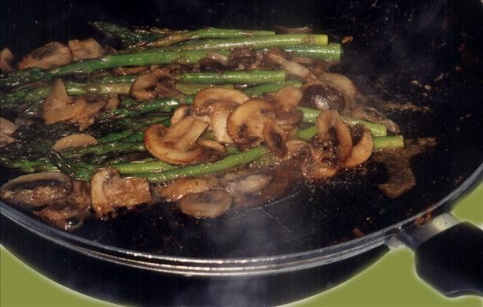

# Asparagus Spears with Mushrooms

## Ingredients

- 500g Asparagus Spears
- 1/4 cup Butter
- 2 cup Mushroom, sliced
- 2 tbsp. Dijon mustard
- 1/4 tsp Black Pepper, ground
- 1/2 tsp Garlic, minced

## Method

1. Place asparagus in skillet, adding just enough water to cover.
2. Boil for 5-7 minutes, or until asparagus is crisp-tender.
3. Drain well, return asparagus to skillet, and add remaining ingredients.
4. Cook over medium heat for 5-7 minutes or until mushrooms have heated through.
