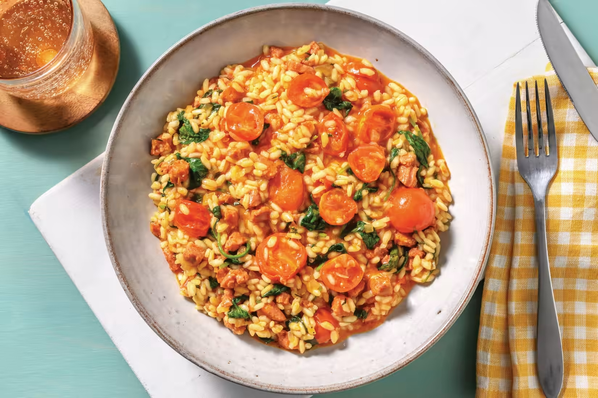

# Baked Chorizo And Spinach Risotto

_What happens when you cook chorizo with fragrant herbs, garlic and onion, then use this concoction as the base for risotto?
We could tell you, but the best way to find out is to try it yourself!
While you're at it, throw in some roasted cherry tomatoes for a sweet burst of flavour that also works to cut through the lovely richness of the dish._

**Source**: [https://www.hellofresh.com.au/recipes/baked-chorizo-spinach-risotto-63a5188e3ff7f0537e042193](https://www.hellofresh.com.au/recipes/baked-chorizo-spinach-risotto-63a5188e3ff7f0537e042193)

**Servings**: 2 

## Ingredients

- 250g Chorizo
- 1 brown onion
- 1 tsp garlic paste
- 1 cup arborio rice
- 500mL chicken stock
- 1 punnet cherry tomatoes
- 1 tbsp butter
- 60g baby spinach leaves
- 1 tbsp Italian herbs
- 25g Shaved Parmesan cheese

## Method

### Preparation
1. Preheat oven to 220°C/200°C fan-forced.
2. Roughly chop mild chorizo.
3. Thinly slice brown onion. 
4. Halve cherry tomatoes

### Start Risotto
1. In a large frying pan, heat a drizzle of olive oil over medium-high heat. Cook chorizo, stirring, until golden and crisp, 3-4 minutes.
2. Add onion and cook, stirring, until softened, 4 minutes.
3. Add garlic paste and Italian herbs and cook until fragrant, 1 minute.
4. Stir in arborio rice until well combined.

### Bake
1. Add the water and chicken stock pot to the pan. Stir well, then bring to the boil.
2. Transfer risotto to a baking dish. Cover tightly with foil.
3. Bake until liquid is absorbed and rice is 'al dente', 24-28 minutes. 
4. Meanwhile, Place cherry tomatoes on a lined oven tray. Drizzle with olive oil, season with salt and pepper and toss to coat.
5. Roast tomatoes until blistered, 15-20 minutes

### Serve
1. When the risotto is ready, stir through a splash of water to loosen, if needed.
2. Stir in shaved Parmesan cheese, the butter and baby spinach leaves.
3. Gently fold in roasted tomatoes. Season to taste.
