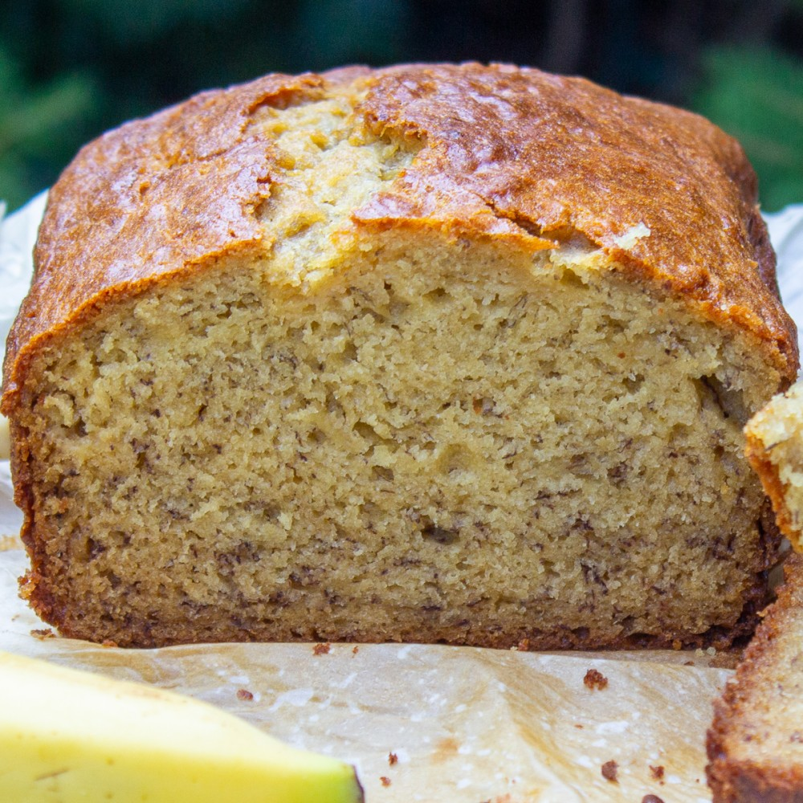

# Banana Bread

## Ingredients

- 2 cup self raising flour, sifted
- 125g butter
- 3 ripe bananas
- 1 tsp. lemon juice
- 3/4 cup sugar
- 2 eggs
- 1 tsp. Bicarbonate Soda
- 1 tsp milk

## Method

### Cake
1. Preheat fan-forced oven to 180°C
2. Mash banana's and sprinkle with lemon juice
3. Beat butter and sugar until creamy
4. Add eggs one at a time
5. Mix in bananas
6. Dissolve Bicarb in milk
7. Add milk and sifted flour alternatively
8. Bake in medium oven for 50 minutes

### Icing
1. Beat 90g butter in bowl until creamy
2. Add 2/3 cup icing sugar
3. Add 1 tsp. vanilla
4. Add 2 tbsp. warm milk, lemon juice to taste
