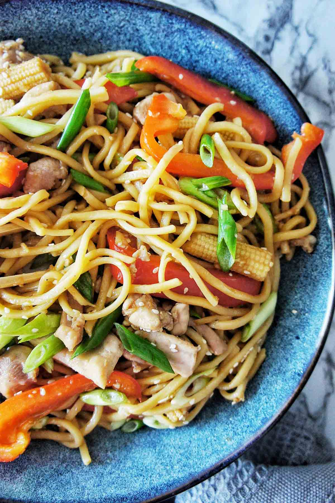

# Chicken Noodle Stir-Fry

## Ingredients

- 2x chicken breasts, diced
- 1 clove garlic, crushed
- Sweet chili sauce
- 1 tbsp. olive oil
- 1 pack 2 minute noodles
- 1 onion, sliced
- Cashew nuts
- Rainbow vegetables (shredded cabbage, carrot, whatever)

## Method
1. Add chicken, garlic, sweet chili and oil to a bowl. Coat chicken
2. Cook chicken in a pan until brown
3. Add onion and cashews and cook until onion is soft
4. Cook 2 minute noodles (with or without MSG packet). Strain and add to chicken
5. Add rainbow vegetables
