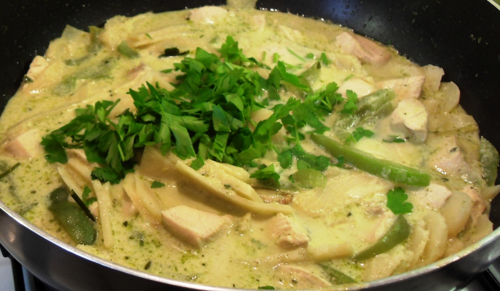

# Green Thai Chicken Curry

## Ingredients

1. 8 Chicken Thighs
2. Ayam Green Curry paste
3. 1 cup chicken stock
4. green beans
5. 1 large onion, sliced
6. 1 can sliced bamboo shoots, drained
7. asian mushrooms
8. 1/4 piece lemon or handful lemongrass
9. 1-2 limes
10. 1/2 bunch basil
11. 1 can coconut milk or cream
12. 1 tbsp. oil

## Method
1. Heat oil in pan on medium high
2. Add 1 tbsp. curry paste. It's normal to not be able to breathe ;)
3. Add onion and cook until soft
4. Add beans, mushrooms and bamboo shoots and lemon piece
5. Add chicken stock and coconut milk and bring to a low boil
6. Stir chicken through and push all chicken pieces under the liquid
7. Keep on a low boil for at least 15 minutes / until chicken is cooked through
8. Add basil and simmer until ready to eat. Make rice.
9. Serve