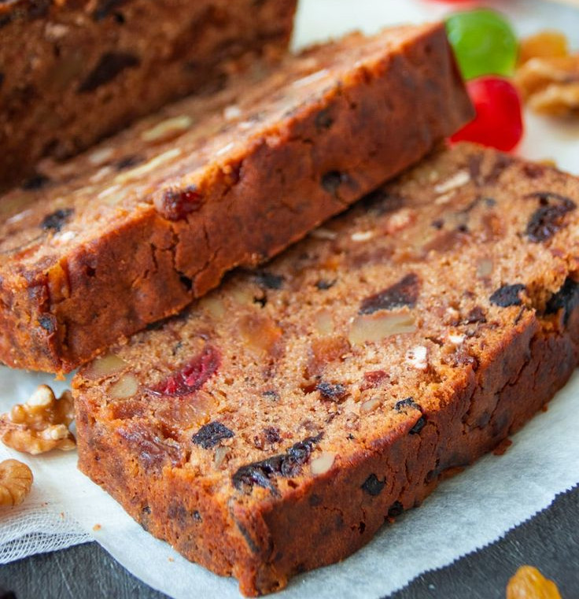

# Melt-and-Mix Christmas Cake

Mum's Christmas Cake

## Ingredients

- 1.5Kg (3lb) mixed Fruit
- ½ cup sherry, rum, or brandy
- 1 green apple
- 1 tbsp honey or golden syrup
- 1 cup brown sugar, firmly packed
- 4 large eggs
- 250g (8oz) butter
- 1 ½ cups plain flour
- ½ cup self-raising flour
- 1 tsp mixed spice
- 2 tbsp sherry, rum, or brandy, extra