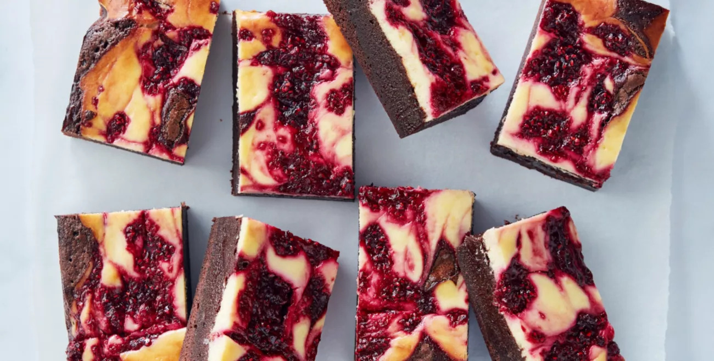

# Raspberry Cheesecake Brownies

## Ingredients

###  Brownie Layer
- 1 cup brown sugar
- 1 cup plain flour
- 1 tbs vanilla extract
- 1/2 cup cocoa powder
- 3 free range eggs, lightly beaten
- 1 cup caster sugar
- 250g unsalted butter, melted

### Cheesecake Layer
- 250g cream cheese, softened
- 1 tsp vanilla extract
- 1 free range egg
- 1/3 cup caster sugar

### Raspberry layer
- 1 cup frozen raspberries
- 1 tbs caster sugar

## Method

1. Preheat oven to 180°C/160°C fan-forced
Lightly grease and line a 27.5 x 17.5cm (3.5cm deep) slice tin with baking paper.

2. Raspberry Layer
Place raspberries and sugar in a small microwave-safe bowl and stir to combine.
Microwave on high for 2 minutes, then gently stir and set aside.

3. Cheesecake Layer
Add cream cheese and caster sugar to a food processor and blitz until smooth.
Add egg and vanilla and blitz until combined.

4. Brownie:
Combine sugar and butter in a large bowl.
Add remaining ingredients with a pinch of salt and mix until combined.

5. Assemble:
Place brownie mixture into tin and use the back of a spoon to level.
To create a marble effect, dollop cream cheese over brownie, followed by dollops of raspberry.
Run a skewer through pan in 3cm intervals in one direction, then run skewer through at three evenly spaced intervals in the other direction to finish.

6. Bake:
Bake for 45 minutes or until mixture has only a slight wobble.
Remove tin from oven and allow to cool completely, then transfer tin to fridge for 2 hours or overnight before serving.