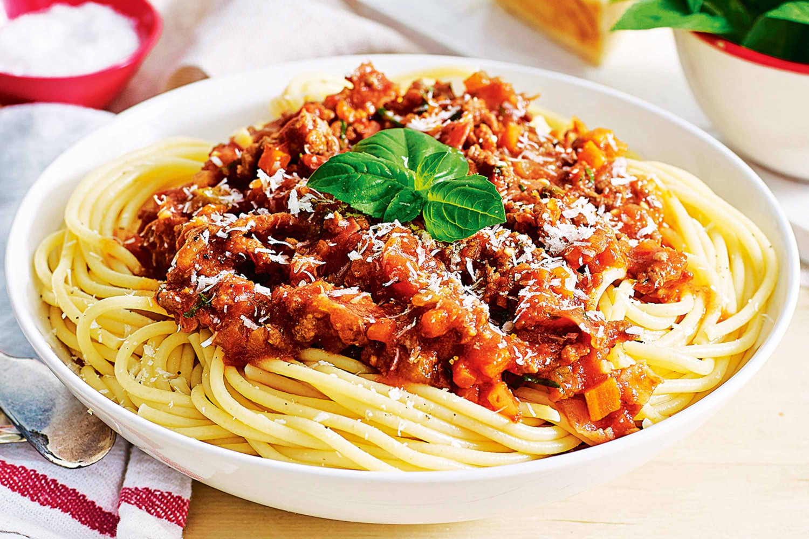

# Spaghetti Bolognese

## Ingredients: Fresh
- 500g Mince
- 1x Carrot
- 1x Zuchinni
- 1x Onion
- 1x Garlic clove
- Parsely

## Ingredients: Pantry

- Dry red wine
- 250mL chicken stock
- Tomato soup, condensed
- Tomato paste
- Tomato sauce
- Sweet chili sauce

## Method

1. Heat oil over medium heat then add onion and garlic. Cook until soft.
2. Add mince and brown lightly.
3. Add wine and oregano, simmer until liquid evaporates.
4. Add tomato paste and combine well.
5. Add tomato soup, chicken stock, tomato sauce, and sweet chili sauce.
6. Bring to the boil, then reduce to a simmer for 1 hour
7. Cook pasta as required.
8. Season with parsely prior to serving on pasta. Top with parmesan cheese
