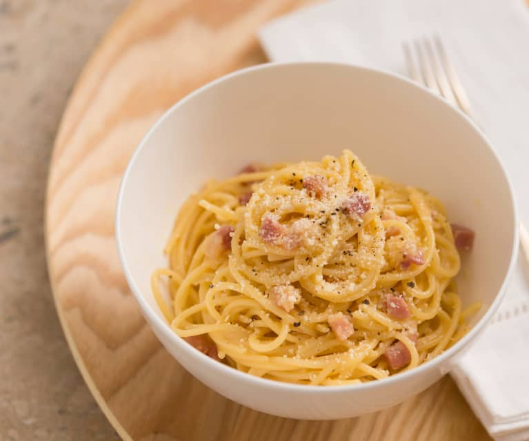

# Spaghetti Carbonara

## Ingredients

500g dried spaghetti

- 8 rindless bacon slices (about 450g)
- 180g (2 cups) sliced button mushrooms (optional)
- 2 tsp olive oil
- 4 eggs, lightly beaten
- 50g (½ cup) freshly grated parmesan cheese
- 300ml (1¼ cups) pouring cream
- finely snipped chives, to garnish (optional)

### Method

1. Cook the spaghetti in a large saucepan of boiling salted water until al dente, then drain and return to the pan.
2. Meanwhile, cut the bacon into thin strips. Heat the olive oil in a heavy-based frying pan, add the bacon and cook over medium heat, stirring often, for 5–6 minutes, or until crisp. Remove and drain on paper towels.
3. (Optional) Fry mushrooms for 2-3 mins until soft
4. Whisk the eggs, parmesan and cream in a bowl until combined. Add the bacon (and mushrooms if desired)
5. Pour the mixture over the hot pasta in the pan. Toss to coat the pasta with the sauce and cook over a very low heat for 1 minute, stirring, or until slightly thickened — take care not to overheat the sauce, or the eggs will scramble.
6. Season with freshly ground black pepper then divide among warmed bowls.
7. 