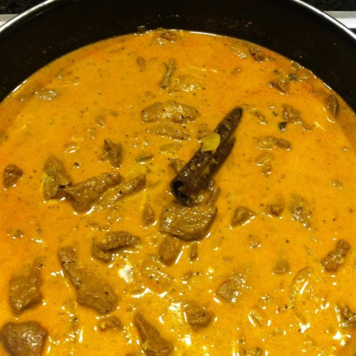

# Sri Lankan Beef Curry

## Ingredients

### Marinate

- 1.3kg Beef, cubed
- 6 cloves garlic
- 1" piece ginger
- 3 1/2 tbsp white vinegar
- 2 tsp salt
- 1 tbsp ground black pepper
- 1 tbsp curry powder, toasted
- 1 1/2 tbsp cayenne pepper

### Cook
- 3 tbsp vegetable oil
- 8 fresh curry leaves
- 4 strips pandan leaf
- 1" piece cinnamon stick
- 1 onion, sliced

### Simmer Sauce
- 2 tbsp tomato paste
- 1 cup water
- 1 cup thick coconut milk or cream
- 2 whole cloves
- 4 green cardamom pods

## Method

### Marinate

1. Crush ginger and garlic into a bowl
2. Add vinegar, salt, pepper, toasted curry and cayenne powder
3. Mix into a paste
4. Add beef, mix until all is coated with the marinate
5. Set aside for 30min.

### Cook

1. Heat oil in a pot to medium heat
2. Add curry leaves and pandan strips
3. Stir in onions and cinnamon stick.
4. Cook until translucent and soft (~5min).
5. Stir in tomato paste and water
6. Add cloves and cardamom pods
7. Add Beef and Simmer covered for 1 1/2 hours or until meat is tender.
8. Simmer covered for 1 1/2 hours or until meat is tender.
9. Cook rice
10. Check every 30min, Add water or coconut milk if the curry is too dry
11. Add coconut milk and heat through
