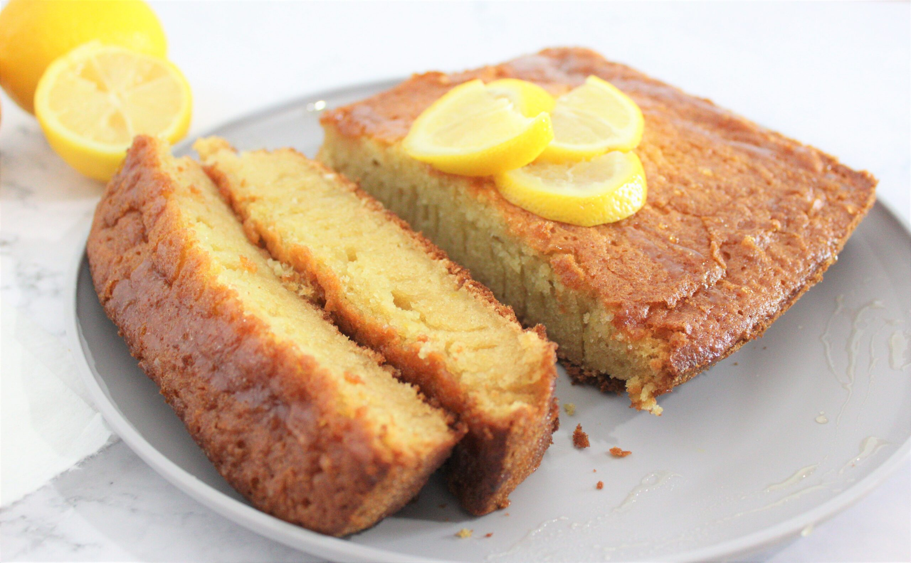

# Tangy Lemon Cake

## Ingredients

- 3/4 cup s.r. flour, sifted
- 1/2 cup plain flour, sifted
- 2/3 cup caster sugar
- 125g (4oz) soft butter
- 1/3 cup milk
- 2 eggs
- 2 tsp. grated lemon rind
- 1/4 cup sugar
- 1/4 cup lemon juice

## Method

1. Preheat fan-forced oven to 180°C and grease pan
2. Combine batter ingredients and beat on medium until mixed and colour changes
3. Bake for 40-45 mins until middle springs back
4. Allow to cool and invert on tray
5. Heat lemon juice and sugar, stirring until sugar is dissolved
6. Put cake back in tin and pour lemon juice over the top
7. Get it out somehow